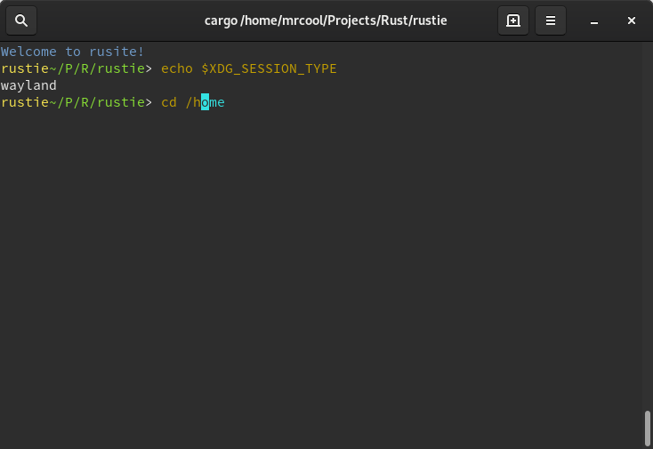

# rustie
Cross Platform Shell



## Tips/Tricks

- Configuration file location: $HOME/.config/rustie/rustie.config
- You can set custom env variables by using SETUVAR in the config file, example:
```
- cat rustie.config
-> SETUVAR RUSTIE_PATH /home/user/.cargo/bin
```
- `RUSTIE_PATH` is a special variable used to tell rustie where to look for additional binaries

- Rustie can handle math thanks to [evalexpr](https://github.com/ISibboI/evalexpr)

## [Changelog](./CHANGELOG.md)
